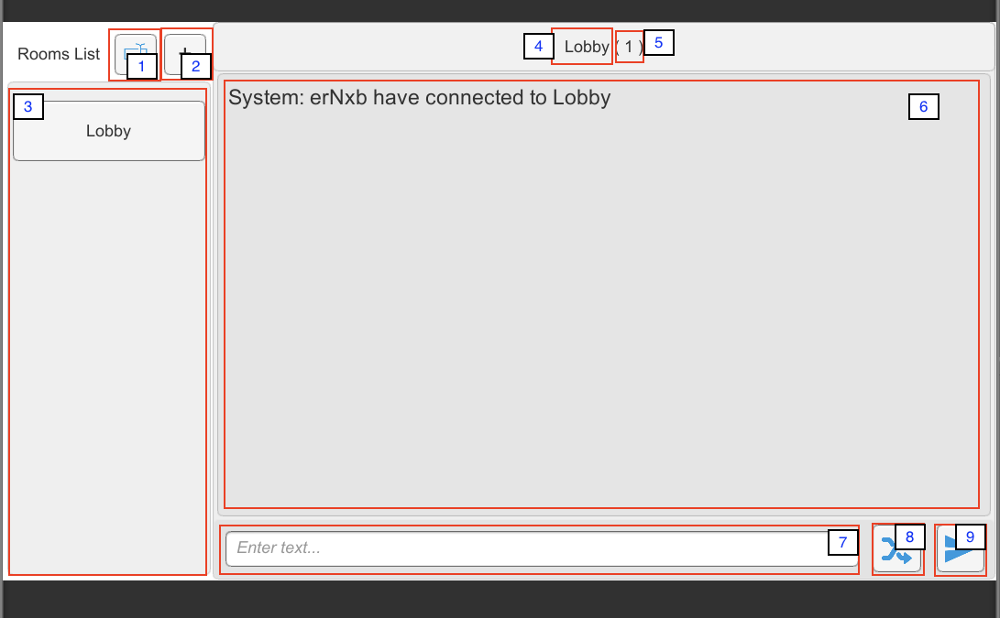

# Unity-Scoket-IO-Room-Match-Chat

##Develop Environment
####Unity : 5.6.1p1 

##Quick Guide
1. Install Node.JS recommand version [HERE](https://nodejs.org/en/)
2. Install Socket.IO 

	```
	$ npm install socket.io
	```
3. Run [**Node-Server/main.js**]()

	```
	$ node main.js
	```
4. Change host **IP** address in **Unity-Project/Asset/Resources/config/host.text** 

	```
	ws://127.0.0.1:4567/socket.io/?EIO=4&transport=websocket
	```
5. Open ```Asset/Scenes/JoinRoomSandbox.unity```  / ```Unity-Build/mac/build.app``` / ```Unity-Build/win/window.exe```
	1. Rename button
	2. Add room button
	3. Rooms list ( Default in Lobby )
	4. Room name
	5. Number of users in room
	6. Message view
	7. Input message field
	8. Start generator random message per farme update button
	9. Send message button
	